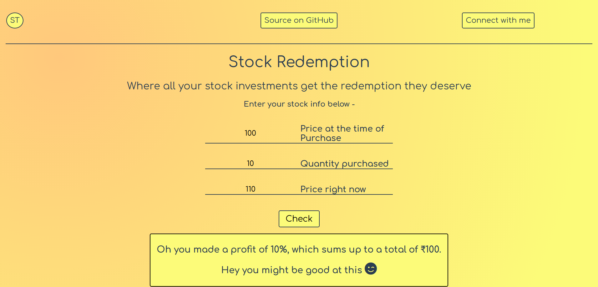
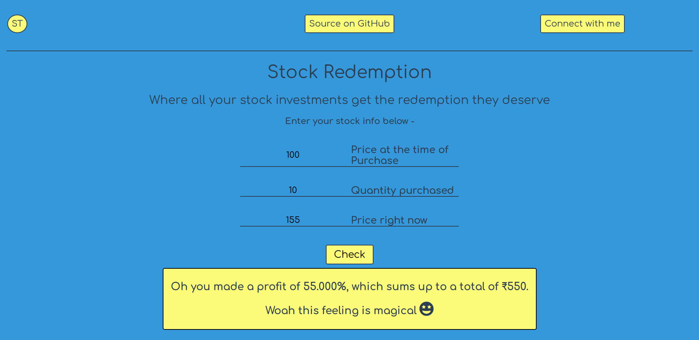
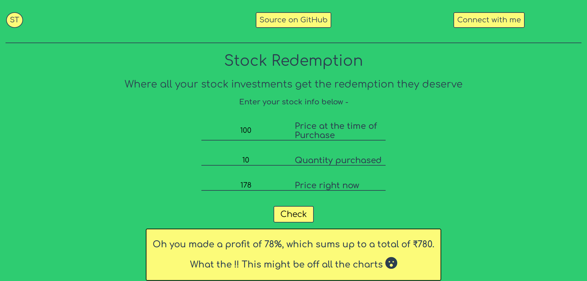
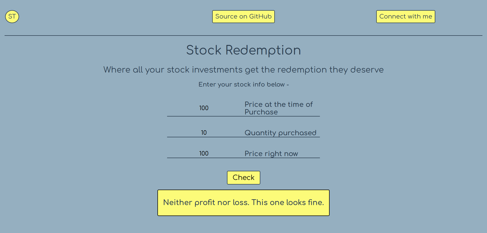
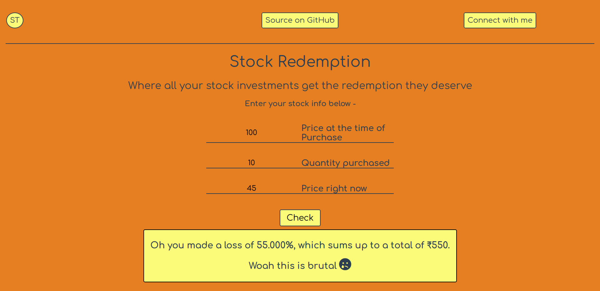
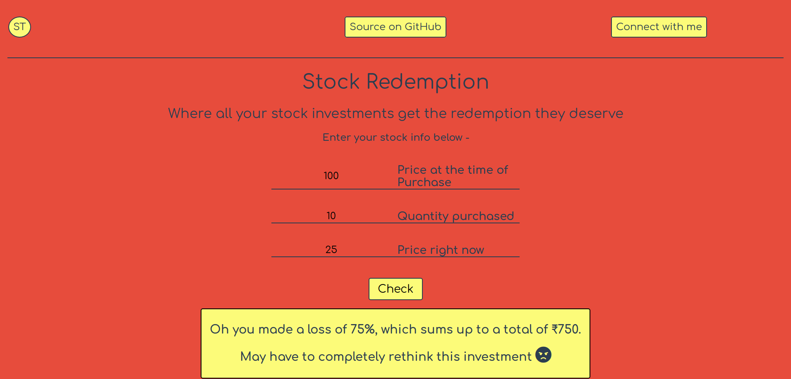

# Stock Redemption(SR)

Do you want to know how good your stocks are doing ?

Or,

Maybe check if there is any downfall in their prices ?

Well whatever you might wanna know, [Stock Redemption](https://stockredemption.netlify.app/) can help you. It calculates how much profit/loss you are making on a company's stock/s. This is shown in sheer raw numbers (if you are interested in that maths), along with percentage of change(i.e. profit/loss).

The app has some alerting features wherein it changes it's theme to alert whenever loss >= 50% or profit >= 50%.

